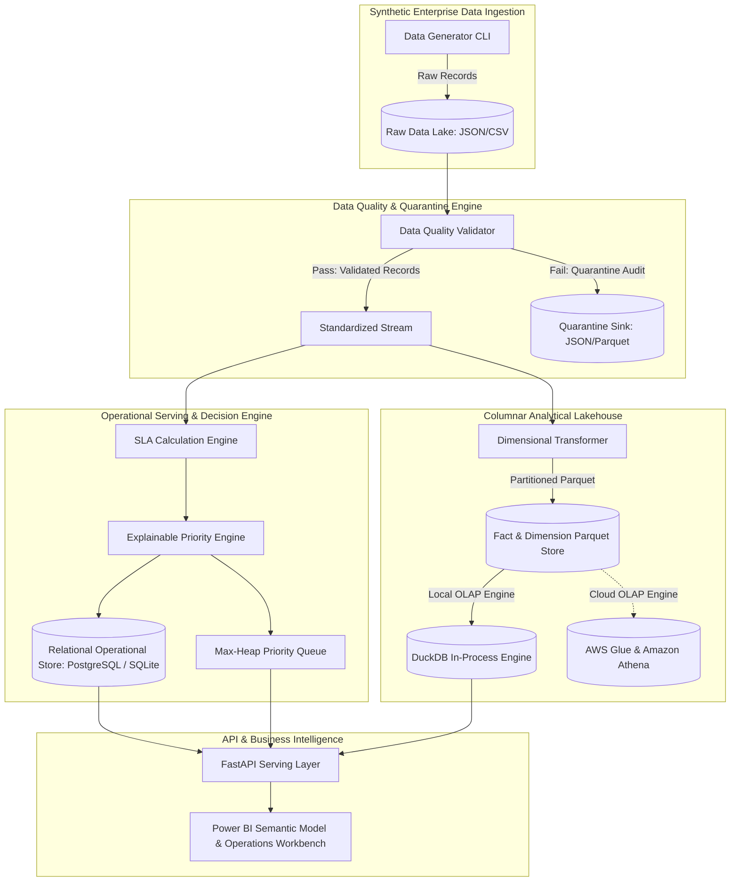

# SWITCHYARD: Architecture & System Design Specification

## 1. System Overview & Problem Statement
SWITCHYARD is an enterprise operational decision-support system and service reliability workbench. In high-velocity service environments (financial transaction processing, logistics dispatch, telecommunications, cloud infrastructure), millions of operational events generate thousands of exceptions daily. Unstructured operational noise buries critical SLA breaches and high-impact enterprise incidents.

SWITCHYARD provides end-to-end data lineage from raw ingested events through rigorous data-quality quarantine, partitioned columnar data lake storage, an explainable multi-factor prioritization engine, and high-performance operational serving APIs.

---

## 2. Conceptual Architecture Diagram

---

## 3. High-Level Architectural Principles

1. **Separation of Operational and Analytical Concerns:**
   - **Operational Serving (PostgreSQL/SQLite):** Stores low-latency mutable state: active exception records, current SLA warning levels, assigned technicians, and real-time triage queues.
   - **Analytical Lake (Parquet + DuckDB/Athena):** Stores immutable historical events, daily SLA aggregations, and dimensional reference tables structured for OLAP scanning.

2. **Idempotence and Deterministic Lineage:**
   - Every raw operational event receives a deterministic entity identifier (`event_id`, `request_id`, `exception_id`) based on canonical business keys.
   - Re-running pipelines over the same operational window produces identical state without duplicate records.

3. **Explicit Data-Quality Quarantine:**
   - No row is discarded silently. Any record failing referential integrity, timestamp logic, or critical null checks is tagged with an error code and written to the quarantine partition (`data/rejected/` or `s3://.../rejected/`).

4. **Transparent, Explainable Prioritization:**
   - Priority is not a magic number. Every priority score (0–100) is accompanied by human-readable operational drivers explaining why an item was placed into Priority Band P1, P2, P3, or P4.

---

## 4. Dimensional Data Model (Star Schema)

### Fact Tables
1. **`FactOperationalEvent`**
   - **Grain:** One row per discrete operational state change or diagnostic event.
   - **Keys:** `event_sk` (surrogate PK), `event_id` (business key), `date_sk` (FK), `customer_sk` (FK), `service_sk` (FK), `location_sk` (FK), `agent_sk` (FK).
   - **Measures:** `duration_ms`, `payload_bytes`, `retry_count`, `error_code_numeric`.
2. **`FactSLA`**
   - **Grain:** One row per SLA compliance lifecycle for a service request or work order.
   - **Keys:** `sla_sk` (surrogate PK), `sla_id` (business key), `request_id` (FK), `customer_sk` (FK), `service_sk` (FK), `start_date_sk` (FK), `due_date_sk` (FK).
   - **Measures:** `target_minutes`, `elapsed_minutes`, `remaining_minutes`, `breach_magnitude_minutes`, `is_breached` (0/1), `is_at_risk` (0/1).
3. **`FactException`**
   - **Grain:** One row per operational exception detected.
   - **Keys:** `exception_sk` (surrogate PK), `exception_id` (business key), `event_id` (FK), `customer_sk` (FK), `service_sk` (FK), `location_sk` (FK).
   - **Measures:** `financial_exposure_usd`, `priority_score`, `priority_band_numeric`, `triage_duration_minutes`, `resolution_duration_minutes`.

### Dimension Tables
- **`DimCustomer`:** `customer_sk`, `customer_id`, `customer_name`, `tier` (Enterprise, Commercial, Retail), `contract_sla_tier`, `industry`.
- **`DimService`:** `service_sk`, `service_id`, `service_name`, `service_category`, `tier_level`, `default_sla_minutes`.
- **`DimLocation`:** `location_sk`, `location_id`, `region`, `datacenter_zone`, `country`, `latitude`, `longitude`.
- **`DimAgent`:** `agent_sk`, `agent_id`, `agent_name`, `team_name`, `skill_level`, `shift`.
- **`DimDate`:** `date_sk`, `full_date`, `year`, `quarter`, `month`, `day`, `day_of_week`, `is_weekend`.

---

## 5. Security & Secret Management Architecture
- **Environment Isolation:** Zero credentials in source code. Configuration managed via Pydantic `BaseSettings` reading from `.env` or system environment variables.
- **Least Privilege Access:** AWS IAM policies scoped strictly to prefix boundaries (`switchyard-lake/processed/*`).
- **Data Sanitization:** Synthetic generation ensures no real PII (Personally Identifiable Information) or sensitive proprietary data enters the repository.
