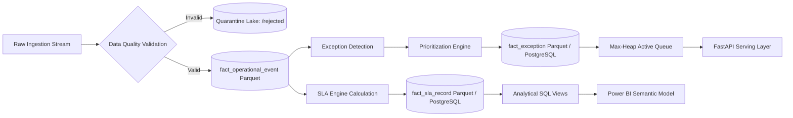

# SWITCHYARD: Data Dictionary & Lineage Specification

## Section 1: Entity & Field Definitions

### 1. `dim_customer`
| Field Name | Physical Type | Logical Type | Nullable | Description & Domain |
| :--- | :--- | :--- | :--- | :--- |
| `customer_sk` | `BIGINT` | Surrogate Key | No | Auto-incrementing dimension key. |
| `customer_id` | `VARCHAR(32)` | Business Key | No | Canonical ID format: `CUST-[0-9]{6}`. |
| `customer_name` | `VARCHAR(128)` | Name | No | Synthetic enterprise customer name. |
| `tier` | `VARCHAR(16)` | Category | No | `Enterprise`, `Commercial`, `Retail`. |
| `contract_sla_tier`| `VARCHAR(16)` | Category | No | `Gold`, `Silver`, `Bronze`. |
| `industry` | `VARCHAR(64)` | Category | No | e.g. `Finance`, `Healthcare`, `Logistics`. |

### 2. `dim_service`
| Field Name | Physical Type | Logical Type | Nullable | Description & Domain |
| :--- | :--- | :--- | :--- | :--- |
| `service_sk` | `BIGINT` | Surrogate Key | No | Primary dimension key. |
| `service_id` | `VARCHAR(32)` | Business Key | No | Canonical ID format: `SRV-[0-9]{4}`. |
| `service_name` | `VARCHAR(128)` | Text | No | e.g. `Realtime Payments API`, `Dispatch Engine`. |
| `service_category`| `VARCHAR(32)` | Category | No | `Core Processing`, `Edge Routing`, `Database`. |
| `tier_level` | `INT` | Integer | No | Criticality level: `1` (Mission Critical) to `3`. |
| `default_sla_min` | `INT` | Measure | No | Standard response window in minutes. |

### 3. `dim_location`
| Field Name | Physical Type | Logical Type | Nullable | Description & Domain |
| :--- | :--- | :--- | :--- | :--- |
| `location_sk` | `BIGINT` | Surrogate Key | No | Primary dimension key. |
| `location_id` | `VARCHAR(32)` | Business Key | No | Canonical ID format: `LOC-[A-Z]{3}-[0-9]{2}`. |
| `region` | `VARCHAR(32)` | Category | No | `US-East`, `US-West`, `EU-Central`, `APAC-South`. |
| `datacenter_zone` | `VARCHAR(32)` | Text | No | Availability zone identifier. |
| `country` | `VARCHAR(32)` | Text | No | Country name. |

### 4. `fact_operational_event`
- **Grain:** One row per physical state-change event or telemetry diagnostic emitted by an operational system.
| Field Name | Physical Type | Logical Type | Nullable | Description & Source |
| :--- | :--- | :--- | :--- | :--- |
| `event_sk` | `BIGINT` | Surrogate Key | No | Event sequence identifier. |
| `event_id` | `VARCHAR(64)` | Business Key | No | UUIDv4 / deterministic SHA-256 event ID. |
| `timestamp` | `TIMESTAMP` | Temporal (UTC) | No | Exact event emission timestamp. |
| `customer_id` | `VARCHAR(32)` | Foreign Key | No | References `dim_customer.customer_id`. |
| `service_id` | `VARCHAR(32)` | Foreign Key | No | References `dim_service.service_id`. |
| `location_id` | `VARCHAR(32)` | Foreign Key | No | References `dim_location.location_id`. |
| `event_type` | `VARCHAR(32)` | Category | No | `REQUEST_RECEIVED`, `PROCESSING_FAILED`, `RETRY_INITIATED`, `TIMEOUT`. |
| `duration_ms` | `INT` | Metric | Yes | Execution time in milliseconds. |
| `payload_bytes`| `INT` | Metric | Yes | Transaction payload size. |
| `status_code` | `INT` | Metric | No | HTTP / Protocol response code (e.g., 200, 500, 504). |

### 5. `fact_sla_record`
- **Grain:** One row per SLA evaluation instance for an operational case.
| Field Name | Physical Type | Logical Type | Nullable | Description & Formula |
| :--- | :--- | :--- | :--- | :--- |
| `sla_id` | `VARCHAR(64)` | Primary Key | No | Canonical SLA instance ID (`SLA-[0-9]{8}`). |
| `case_id` | `VARCHAR(64)` | Foreign Key | No | References case or work order ID. |
| `start_time` | `TIMESTAMP` | Temporal (UTC) | No | SLA clock start timestamp. |
| `target_minutes`| `INT` | Metric | No | Configured target duration. |
| `elapsed_minutes`| `FLOAT` | Metric | No | Actual elapsed time up to current clock or resolution. |
| `remaining_minutes`| `FLOAT` | Metric | No | `target_minutes - elapsed_minutes`. |
| `sla_status` | `VARCHAR(16)` | Category | No | `ON_TRACK`, `AT_RISK`, `BREACHED`. |

### 6. `fact_exception`
- **Grain:** One row per operational failure requiring triage.
| Field Name | Physical Type | Logical Type | Nullable | Description & Drivers |
| :--- | :--- | :--- | :--- | :--- |
| `exception_id`| `VARCHAR(64)` | Primary Key | No | Canonical ID (`EXC-[0-9]{8}`). |
| `event_id` | `VARCHAR(64)` | Foreign Key | No | Triggering operational event. |
| `financial_exposure`| `FLOAT` | Metric (USD) | No | Modeled financial exposure at risk. |
| `priority_score`| `FLOAT` | Metric (0-100)| No | Weighted output from `PriorityEngine`. |
| `priority_band` | `VARCHAR(4)` | Category | No | `P1`, `P2`, `P3`, `P4`. |
| `lifecycle_state`| `VARCHAR(16)` | Category | No | `DETECTED`, `TRIAGED`, `ASSIGNED`, `IN_PROGRESS`, `RESOLVED`, `CLOSED`. |
| `reason_drivers`| `JSON / TEXT` | Explainability | No | List of human-readable rationale strings. |

---

## Section 2: Data Lineage Matrix

### Traceability of Core Executive Metrics
1. **SLA Breach Rate (%):**
   `COUNT(CASE WHEN sla_status = 'BREACHED' THEN 1 END) / COUNT(total_cases)`
   - Derived from: `fact_sla_record` joined with `dim_service` and `dim_date`.
2. **Current Backlog:**
   `COUNT(CASE WHEN lifecycle_state NOT IN ('RESOLVED', 'CLOSED') THEN 1 END)`
   - Derived from: `fact_exception` active serving table in PostgreSQL.
3. **Median Resolution Duration (Minutes):**
   `PERCENTILE_CONT(0.5) WITHIN GROUP (ORDER BY resolution_minutes)`
   - Derived from: historical resolved cases in `fact_exception` Parquet files.
